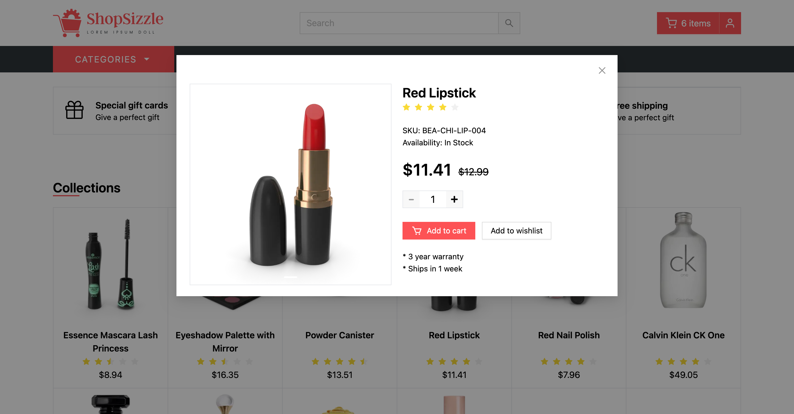
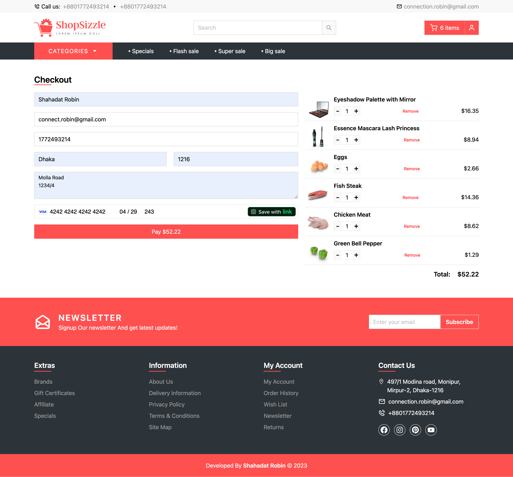

## [🛍️ Shop Sizzle](https://shop-sizzle.vercel.app)

A full-featured eCommerce web application built with [Next.js](https://nextjs.org/) 13 (Pages Router), TypeScript, Redux, Tailwind CSS, and Ant Design. This project showcases a complete frontend shopping experience, including product browsing, cart functionality, and Stripe integration for payments.

## 📸 Demo

#### 🖼️ Homepage Preview

## 

#### 🖼️ Product Preview

## 

#### 🖼️ Checkout Preview

## 

## 🚀 Features

- Fully responsive design (mobile-first)
- Clean UI built using Ant Design + Tailwind CSS
- Type-safe code with TypeScript
- State management with Redux Toolkit
- Bento grid layout in hero section
- Cart persistence via localStorage
- Stripe checkout integration (test mode)

## 🛠️ Tech Stack

| Category       | Tools/Frameworks                   |
| -------------- | ---------------------------------- |
| **Framework**  | Next.js 13 (Pages Router)          |
| **Language**   | TypeScript                         |
| **Styling**    | Tailwind CSS, Ant Design (Antd)    |
| **State**      | Redux Toolkit                      |
| **Payments**   | Stripe (test mode)                 |
| **Routing**    | File-based routing (Next.js pages) |
| **Deployment** | Vercel                             |

## 📦 Installation & Setup

```bash
# Clone the repo
git clone https://github.com/shahadat-robin/shop-sizzle.git

# Navigate to the project directory
cd shop-sizzle

# Install dependencies
npm install

# Run the development server
npm run dev

# Visit the app at [http://localhost:3000](http://localhost:3000)
```

## 📁 Folder Structure

```bash
public/              # Static assets (images, logos)
src/
├── components/      # Reusable UI components (e.g. cart, skeleton etc.)
├── layout/          # Global layout wrappers (e.g. header, footer, layout components)
├── pages/           # Next.js pages (routes)
├── sections/        # Page-level UI sections (e.g. homepage sections)
├── store/           # Redux slices and store configuration
├── utils/           # Utility functions (e.g. helpers)
```
